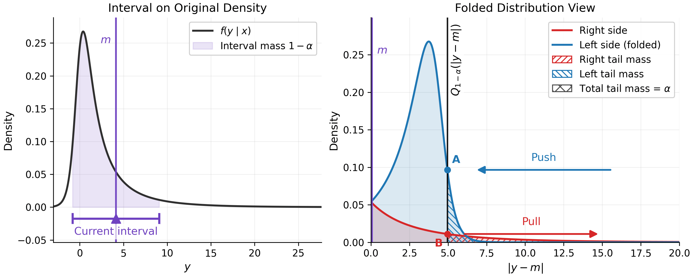

# CoCP: Co-optimization for Adaptive Conformal Prediction

This repository contains a minimal and reproducible implementation of **CoCP** for interval prediction.

## What is CoCP?

**CoCP (Co-optimization for Adaptive Conformal Prediction)** is a novel framework that learns prediction intervals by jointly optimizing a center \(m(x)\) and a radius \(h(x)\). 

Unlike standard methods that often enforce a fixed notion of center, CoCP effectively corrects mis-centering under skewness and heteroscedasticity. By alternating between radius quantile regression and a boundary-local soft-coverage objective, CoCP drives the interval toward high-density regions, yielding tighter intervals and better conditional coverage.


*Figure: The "push-pull" dynamic of CoCP. By balancing boundary densities in a folded geometry, CoCP approximately recovers the optimal Highest Density Interval (HDI).*

## Features

- Only keeps the **CoCP** method
- Supports:
  - synthetic 1D experiments
  - real-data experiments
  - sensitivity studies for:
    - temperature parameter `beta`
    - number of folds `K`
    - alternating iterations `T`
- No hyperparameter tuner
- No extra conformal baselines

---

## Installation

```bash
pip install -r requirements.txt
```

---

## Dataset placement

Put datasets under:

```text
datasets/
```

Supported real datasets in this minimal release:

- `bike`
- `bio`
- `blog`
- `facebook_1`
- `facebook_2`
- `homes`
- `superconductivity`

---

## Run standard experiments

### Synthetic
```bash
python scripts/run_experiment.py --config configs/synth1d.yaml
```

### Real
```bash
python scripts/run_experiment.py --config configs/real.yaml
```

---

## Zhixin Update (April 2)

Zhixin added a drop-in accelerated replacement called `CoCP-Fast` on April 2.

It keeps the same CoCP objective and final conformal calibration, but changes the
training schedule with:

- phase-specific early stopping using `min_delta`
- shorter budgets for `warmup mu`, `refine mu`, and `h`
- optional fold-level parallelism

### How to use the fast variant

Add the following block under `training.cocp` in your config:

```yaml
training:
  cocp:
    variant: "fast"
```

That is enough to switch `run_experiment.py` from the baseline `CoCP` class to
`CoCP-Fast`.

### Optional fast settings

`CoCP-Fast` will automatically provide defaults if you do not set them, but you
can override them explicitly in the config:

```yaml
training:
  cocp:
    variant: "fast"
    lr_mu_max: 1.5e-3
    lr_h_max: 8e-4

    warmup_mu_max_epochs: 300
    warmup_mu_patience: 30
    warmup_mu_min_delta: 1e-4

    refine_mu_max_epochs: 120
    refine_mu_patience: 15
    refine_mu_min_delta: 5e-5

    h_max_epochs: 80
    h_patience: 12
    h_min_delta: 5e-5

    n_fold_workers: 2
    fold_parallel_backend: "thread"
    fold_num_threads: 1
```

### Code locations

- Baseline method: `cocp/methods.py`
- Fast replacement: `cocp/methods_fast.py`
- Variant dispatch: `cocp/experiment.py`

### Example command

```bash
python scripts/run_experiment.py --config configs/synth1d.yaml
```

If `training.cocp.variant: "fast"` is present in the config, the fast
replacement will be used automatically.

---

## Run sensitivity experiments

```bash
python scripts/run_sensitivity.py --configs configs/synth1d.yaml configs/real.yaml
```

You can also override the search grid:

```bash
python scripts/run_sensitivity.py \
  --configs configs/synth1d.yaml \
  --beta-values 0.002,0.005,0.01,0.02,0.05 \
  --k-values 2,3,4,5 \
  --t-values 0,1,2,3,4,5
```

---

## Plot sensitivity curves

```bash
python scripts/plot_sensitivity.py --exp-dir results/sensitivity/synth1d
python scripts/plot_sensitivity.py --exp-dir results/sensitivity/real
```

---

## Notes

This repository keeps only the code needed for CoCP and its experiments.


## Citation

If you find this repository or our paper useful, please consider citing:

```bibtex
@misc{su2026cooptimizationadaptiveconformalprediction,
      title={Co-optimization for Adaptive Conformal Prediction}, 
      author={Xiaoyi Su and Zhixin Zhou and Rui Luo},
      year={2026},
      eprint={2603.01719},
      archivePrefix={arXiv},
      primaryClass={stat.ML},
      url={https://arxiv.org/abs/2603.01719}, 
}
```

---
