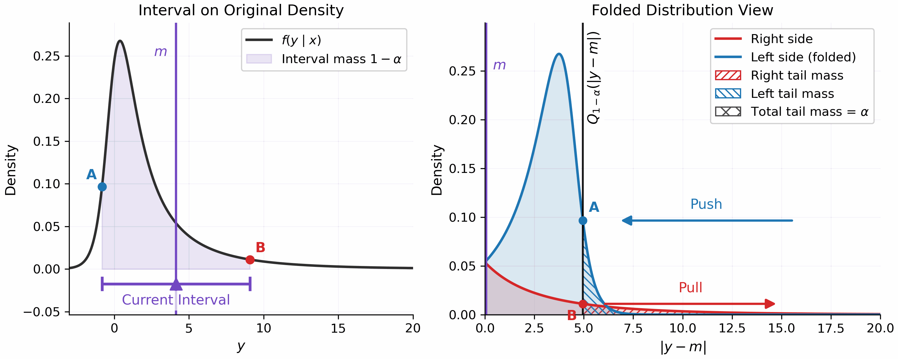

# CoCP: Co-optimization for Adaptive Conformal Prediction

This repository contains a minimal and reproducible implementation of **CoCP** for interval prediction.

## What is CoCP?

**CoCP (Co-optimization for Adaptive Conformal Prediction)** is a novel framework that learns prediction intervals by jointly optimizing a center $m(x)$ and a radius $h(x)$. 

Unlike standard methods with fixed centers, CoCP corrects mis-centering under skewness and heteroscedasticity through a principled alternating optimization framework:

1. **Initialization**: Pre-trains an initial center $m(x)$.
2. **Alternating Optimization**: Iteratively co-optimizes the interval geometry:
   - **Radius Update**: Learns $h(x)$ via smooth quantile regression on folded residuals.
   - **Center Refinement**: Shifts $m(x)$ toward high-density regions using a smooth interval loss.
3. **Fine-tuning & Calibration**: Removes the smoothing bias from $h(x)$ via standard pinball loss, followed by conformal calibration to guarantee marginal coverage.



*Figure: The "push-pull" dynamic of CoCP. By balancing boundary densities in a folded geometry, CoCP approximately recovers the optimal Highest Density Interval (HDI).*

## Features

- **Sample-Adaptive Smoothing (New)**: Introduces a dynamic, instance-dependent temperature parameter $\beta(x)$. By utilizing a lightweight Quantile Regression (QR) warm-up, CoCP scales $\beta$ proportionally to the local interval radius, preserving a consistent geometric shape across the covariate space and eliminating the need for manual tuning.
- **Fast Variant by Default**: Optimized training schedule featuring phase-specific early stopping, shortened budgets, and fold-level multiprocessing.
- **Minimal & Focused**: Contains only the essential CoCP methods, supporting 1D synthetic and real-world benchmarks, alongside comprehensive sensitivity analysis tools.


---

## Installation

```bash
pip install -r requirements.txt
```

---

## Dataset placement

Put datasets under:

```text
datasets/
```

Supported real datasets in this minimal release:
- `bike`, `bio`, `blog`, `facebook_1`, `facebook_2`, `homes`, `superconductivity`

---

## Run standard experiments

### Synthetic
```bash
python scripts/run_experiment.py --config configs/synth1d.yaml
```

### Real
```bash
python scripts/run_experiment.py --config configs/real.yaml
```

---

## Configuration Guide

### 1. The Fast Variant (Default)
The `Fast` variant is now the recommended way to train CoCP. It keeps the exact same objective and conformal calibration but significantly accelerates the offline training phase using K-fold parallelization and strict early stopping.

To ensure the fast variant is used, check your config file under `training.cocp`:

```yaml
training:
  cocp:
    variant: "fast"  # "fast" (parallelized) or "baseline" (original sequential CoCP)
    n_fold_workers: 4
    fold_parallel_backend: "process" # or "thread"
    fold_num_threads: 1
```
**Note on `beta_start` and `beta_end`:**
These parameters were designed for optional exponential annealing of $\beta$ during training. However, we recommend a constant $\beta$. 
**To adjust $\beta$, please set both `beta_start` and `beta_end` to the exact same value.**

### 2. Sample-Adaptive Smoothing (Adaptive $\beta$)
To enable the new sample-adaptive smoothing strategy, use the adaptive variant and configure the `adaptive_beta` parameters:

```yaml
training:
  cocp:
    adaptive_beta: true # Enable adaptive beta
    adaptive_beta_p: 0.8     # Interior proportion
    adaptive_beta_epsilon: 0.01     # Tolerance
    adaptive_beta_q_lo: 0.05     # Lower quantile level
    adaptive_beta_q_hi: 0.95     # Upper quantile level
    adaptive_beta_max_epochs: 400     # Max epochs for QR model
    adaptive_beta_lr: 2.0e-3     # Learning rate for QR model
```
*Note: When `adaptive_beta` is enabled, the algorithm will first perform a QR warm-up to estimate the local radius and assign a specific $\beta_i$ to each sample.*

---

## Sensitivity Analysis

You can easily run ablation and sensitivity studies for hyperparameters like the number of folds `K`, alternating iterations `T`, and the global temperature `beta` (if not using the adaptive strategy).

```bash
python scripts/run_sensitivity.py --configs configs/synth1d.yaml configs/real.yaml
```

You can also override the search grid directly from the command line:

```bash
python scripts/run_sensitivity.py \
  --configs configs/synth1d.yaml \
  --beta-values 0.002,0.005,0.01,0.02,0.05 \
  --k-values 2,3,4,5 \
  --t-values 0,1,2,3,4,5
```

### Plotting Sensitivity Curves

```bash
python scripts/plot_sensitivity.py --exp-dir results/sensitivity/synth1d
python scripts/plot_sensitivity.py --exp-dir results/sensitivity/real
```

## Citation

If you find this repository or our paper useful, please consider citing:

```bibtex
@misc{su2026cooptimizationadaptiveconformalprediction,
      title={Co-optimization for Adaptive Conformal Prediction}, 
      author={Xiaoyi Su and Zhixin Zhou and Rui Luo},
      year={2026},
      eprint={2603.01719},
      archivePrefix={arXiv},
      primaryClass={stat.ML},
      url={https://arxiv.org/abs/2603.01719}, 
}
```

---
